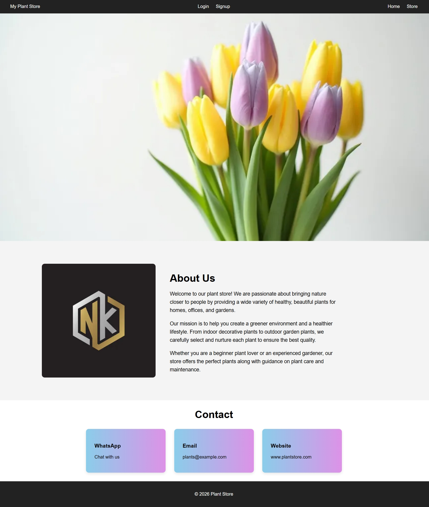
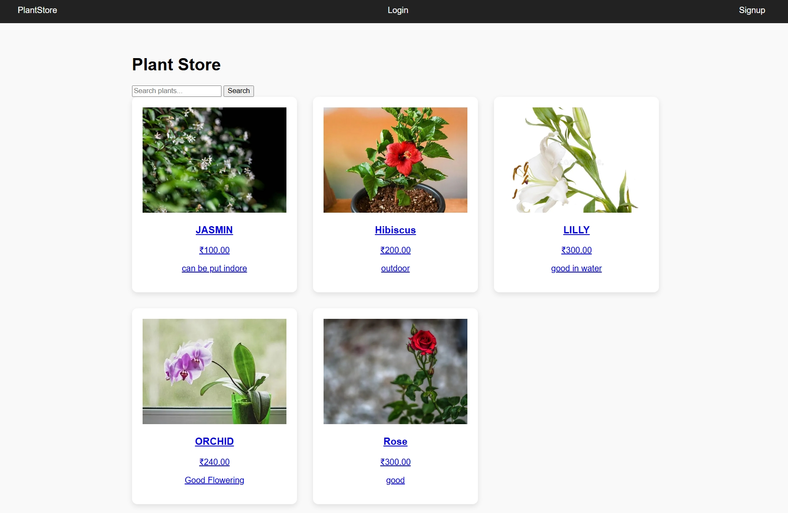
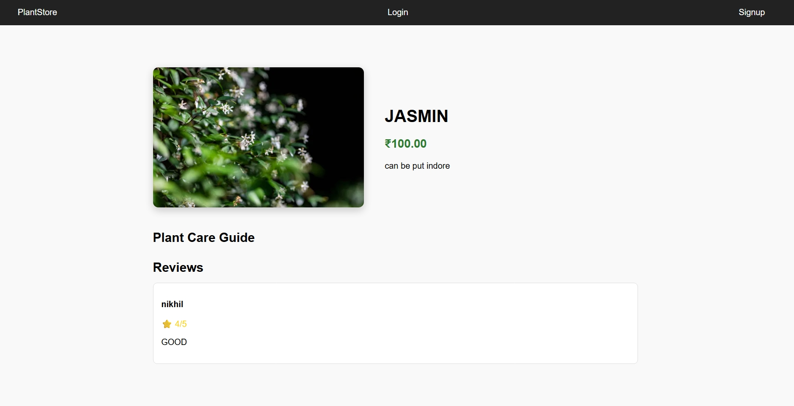

# 🌱 Plant Store – Django Web Application

A simple plant information platform built using Python and Django.
Users can explore different plants, read care guides, and share reviews.

---

## 🚀 Features

* 🌿 View a list of plants
* 🔍 Search plants by name
* 📄 Plant detail page
* ⭐ Users can submit reviews
* 🌱 Plant care guide (sunlight, watering, fertilizer)
* 🔐 User authentication (Signup / Login / Logout)
* 🖼 Image upload for plants
* ⚙ Admin panel to manage plants, reviews, and care guides

---

## 🛠 Tech Stack

* **Backend:** Python, Django
* **Frontend:** HTML, CSS
* **Database:** SQLite
* **Authentication:** Django built-in authentication system

---

## 📂 Project Structure

```
plantstore/
│
├── plantstore/        # Django project settings
├── shop/              # Main application
│   ├── models.py
│   ├── views.py
│   ├── urls.py
│   └── admin.py
│
├── templates/         # HTML templates
│   ├── base.html
│   ├── plant_list.html
│   ├── plant_detail.html
│   ├── login.html
│   └── signup.html
│
├── static/
│   └── css/
│       └── style.css
│
├── media/             # Uploaded plant images
├── db.sqlite3
└── manage.py
```

---

## ⚙ Installation & Setup

### 1️⃣ Clone the repository

```
git clone https://github.com/your-username/plant-store.git
cd plant-store
```

### 2️⃣ Install dependencies

```
pip install django pillow
```

### 3️⃣ Run migrations

```
python manage.py makemigrations
python manage.py migrate
```

### 4️⃣ Create admin user

```
python manage.py createsuperuser
```

### 5️⃣ Start the server

```
python manage.py runserver
```

Open in browser:

```
http://127.0.0.1:8000
```

---

## 👨‍💻 Admin Panel

Access the admin dashboard at:

```
http://127.0.0.1:8000/admin
```

Admin can:

* Add plants
* Upload plant images
* Add plant care instructions
* Manage reviews

---

## 📸 Screenshots

### Home Page


### Shop Page


### Detials Page


---

## 📌 Future Improvements

* 🌟 Average rating display
* 🎨 Improved UI design
* 📱 Responsive mobile layout
* 🪴 Plant categories (Indoor / Outdoor)
* ❤️ Favorites or wishlist feature

---

## 📄 License

This project is for educational purposes.

---

## 🙌 Author

Developed by **Nikhil Nadh S**
